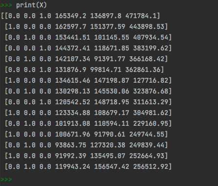

# BusinessProfitPrediction

``` python 
import pandas as pd
import numpy as np
import matplotlib.pyplot as plt
import os

# Importing the dataset
dataset = pd.read_csv('50_Startups.csv')
X = dataset.iloc[:,:-1].values
y = dataset.iloc[:,-1].values
```


```python 
#Encoding the categorical data
from sklearn.compose import ColumnTransformer
from sklearn.preprocessing import OneHotEncoder
en = ColumnTransformer(transformers=[('encoder', OneHotEncoder(), [3])], remainder= 'passthrough')
X = np.array(en.fit_transform(X))
print(X)
```


```python 
# Splitting the dataset into training and test data
from sklearn.model_selection import train_test_split
X_train, X_test, y_train, y_test = train_test_split(X, y, test_size= 0.2, random_state= 0)

# Training the MLR model on the training data
from sklearn.linear_model import LinearRegression
regressor = LinearRegression()
regressor.fit(X_train, y_train)

# Predicting the results of the test data
y_pred = regressor.predict(X_test)
np.set_printoptions(precision=2)
profit = (np.concatenate((y_pred.reshape(len(y_pred),1), y_test.reshape(len(y_test),1)), axis=1))
```


